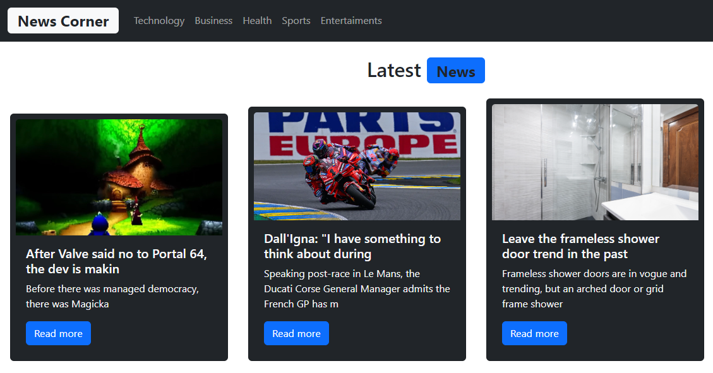

# React News App
A responsive news aggregation app built with React and Bootstrap. Users can browse and search for news articles from various sources using the News API. User authentication and article saving is handled with Firebase.

## Key Features
- Browse top headlines from sources like BBC, CNN, Reuters etc
- Search for news articles by keyword
- View articles with titles, descriptions, images and published dates
- Save articles to a personal read-later list
- Responsive design adapts to different screen sizes
- Authentication with email/password login
- Persistent article saving with Firebase

## Tech Stack

### Frontend

React - JS library
Bootstrap - CSS framework
React Router - Routing
React Icon - Icons component library

### Backend

- Firebase - Authentication, Database
- News API - Article data

## Getting Started

- Clone/download the repo
- Run npm install to install dependencies
- Create Firebase project and add config to .env file
- Get News API key and add to .env
- Run npm start to start dev server
- Sign up/login to access saved articles

